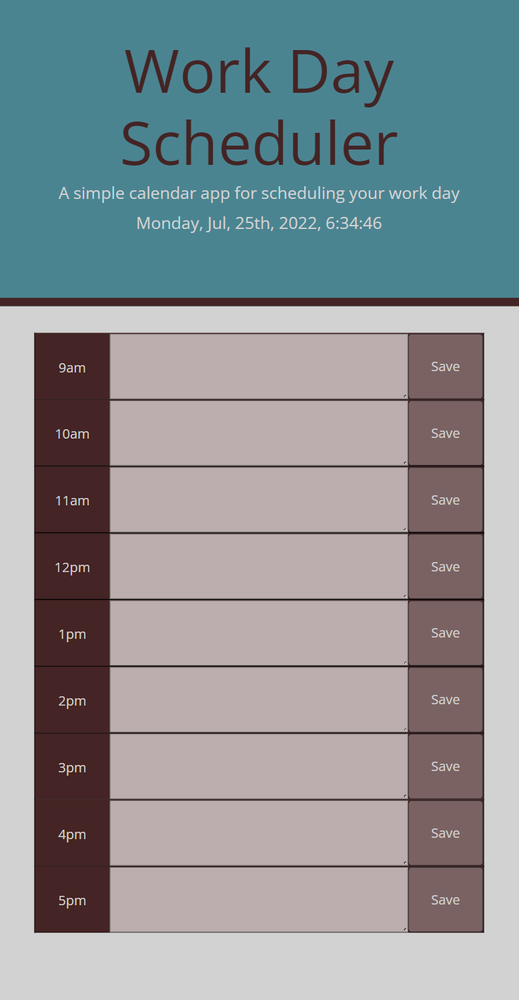

# Workday Schedule

## Description

This project is for the user with a busy work life. The purpose for the program is to allow a user to organize, manage, and execute the various task for there day. 

 [Deployed link](https://jaqwae.github.io/workday-scheduler/)

## Features

I've included the features below using:

- The schedule incorporates moment.js which allow the program to:
	- Display time within the program.
	- Keeps track of what hours have past, is current, or hasn't occurred yet.
- The schedule is equip with a built in storage so the user's input can be saved.
- Color of the calendar changes depending on if the time has passed, is current, or hasn't occurred yet.

What's to come:

- When the user inputs text, it will put them in a nice neat bulleted list.
- User won't have to hit the save but to keep data but simply save the data with a push of a key.
- Text corresponding with the current hour will change a different color.
- User can switch color layout by a press of a button.
- All user input can be clear with a press of a button.
- Will include more hours outside of the work hours.

## Images
;
  

## Credits

- JaQwae Ellison
- University of Texas